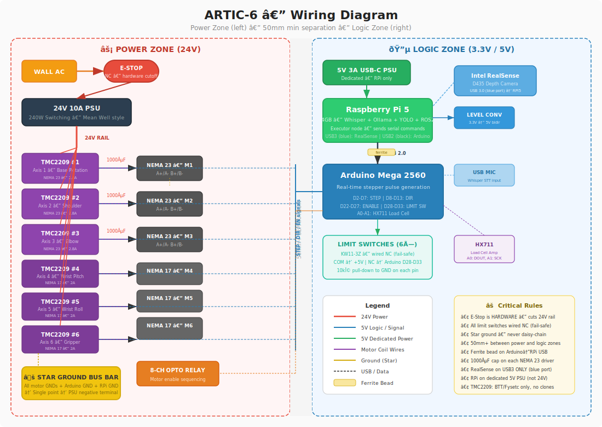

# ARTIC-6 — Voice-Controlled 6-DOF Robotic Arm

> A fully scratch-designed 6-axis robotic arm with 720mm reach, 1kg payload, and natural voice control — built entirely from aluminum plate, stepper motors, and open-source software. No cloud APIs. No subscriptions. Everything runs locally.

<!-- TODO: Replace this line with a screenshot of your Fusion 360 full assembly -->
<!--  -->


---

## Why ARTIC-6?

Most DIY robot arms top out at 300mm reach with hobby servos that can barely lift a marker. ARTIC-6 is designed for **real tasks** — 720mm of reach and 1kg of payload capacity using industrial NEMA 23 steppers with 10:1 belt reductions. The arm understands plain English commands through local speech recognition and executes them using depth-camera vision and inverse kinematics. No cloud, no API keys, no monthly costs.

---

## Hardware Specs

| Spec | Value |
|------|-------|
| Degrees of Freedom | 6 |
| Max Reach | 720mm |
| Payload | 1kg |
| Link 1 (Upper Arm) | 350mm — sandwich: 2× 3mm 6061-T6 Al + 40mm standoffs |
| Link 2 (Forearm) | 280mm — sandwich: 2× 3mm 6061-T6 Al + 40mm standoffs |
| Base Footprint | 250 × 250mm |
| Axes 1-3 Motors | NEMA 23, 1.9Nm, 2.8A + 10:1 GT2 belt reduction |
| Axes 4-6 Motors | NEMA 17, 59Ncm, 2A |
| Drivers | 6× TMC2209 V1.3 (StallGuard + StealthChop) |
| Controller | Arduino Mega 2560 (real-time pulse generation) |
| Brain | Raspberry Pi 5 4GB (motion planning + AI) |
| Base Bearing | 51100 thrust bearing + 608ZZ radial |
| Safety | NC limit switches, hardware E-stop, ±170° hard stops |

---

## Software Stack — 100% Local

```
Voice → Whisper (STT) → Ollama + Llama 3.3 (LLM) → ROS2 + MoveIt2 (IK)
                                    ↑
                    Intel RealSense D435 → YOLO v8 (object detection)
                                    ↓
              Arduino Mega → 6× TMC2209 → 6 Stepper Motors → ARM MOVES
```

Zero cloud. Zero API keys. Zero monthly cost.

---

## Wiring Diagram



[Detailed Wiring & Safety Strategy](./docs/wiring_diagram.pdf) | Full wiring details: [docs/wiring_diagram.md](docs/wiring_diagram.md)

---

## Repository Structure

```
artic-6/
├── bom.csv                 ← Bill of materials with direct shopping links
├── README.md               ← You are here
├── cad/
│   ├── baseplate.dxf       ← 250×250mm base plate (SendCutSend)
│   ├── link1_upper_arm.dxf ← 350mm upper arm plate (order 2×)
│   ├── link2_forearm.dxf   ← 280mm forearm plate (order 2×)
│   ├── thrust_bearing_collar.stl ← 3D print (PETG)
│   └── generate_*.py       ← Python scripts to regenerate CAD files
├── docs/
│   ├── bom.md              ← Detailed BOM with specs and notes
│   ├── build_journal.md    ← Chronological progress log
│   ├── wiring_diagram.md   ← Full wiring strategy
│   ├── wiring_diagram.svg  ← Visual wiring diagram
│   ├── engineering_notes.md← Design decisions and failure analysis
│   └── arm_layout_visual.html ← Interactive arm diagram
├── firmware/
│   └── artic6_firmware/    ← Arduino Mega code (AccelStepper)
│       ├── artic6_firmware.ino
│       ├── config.h        ← Pin defs, speeds, joint limits
│       ├── stepper.h       ← Motor control
│       ├── homing.h        ← Limit switch homing
│       └── serial_protocol.h ← Serial command interface
└── software/               ← Python + ROS2 (in progress)
```

---

## Firmware — Serial Command Interface

The firmware is written and ready to upload. Commands over USB serial at 115200 baud:

```
PING                    → OK PONG
ENABLE                  → OK motors enabled
HOME                    → OK HOME complete
MOVE 2 45.0             → OK MOVE 2 → 45.00  (shoulder to 45°)
MOVA 0 45 -30 0 0 0     → OK MOVA             (all 6 axes)
POS                     → POS 0.00 45.00 -30.00 0.00 0.00 0.00
ESTOP                   → OK ESTOP activated
```

Full command reference: [firmware/README.md](firmware/README.md)

---

## Current Status

| Phase | Status |
|-------|--------|
| Planning & Engineering Review | ✅ Complete |
| CAD — Flat plates (base, links) | ✅ Generated, audited, imported to Fusion 360 |
| CAD — Joint brackets & motor mounts | 🔄 In progress |
| CAD — Full .STEP assembly | 🔄 In progress |
| Firmware v0.1 | ✅ Complete — AccelStepper, homing, serial protocol |
| Parts ordering | ⏳ Waiting on funds |
| Assembly | ⏳ Pending |
| Software (Python + ROS2) | ⏳ Not started |

---

## Budget

| Category | Cost |
|----------|------|
| Motors + Drivers | $84 |
| Gear Reduction (pulleys + belt) | $29 |
| Compute + Electronics | $100 |
| Structure + Hardware (incl. SendCutSend) | $236 |
| Vision + Sensing | $101 |
| Filament (PETG + TPU) | $44 |
| Wiring + Cable Management | $28 |
| **Core Parts Total** | **$622** |
| Tools, shipping, tax, spares | ~$366-$802 |
| **Realistic All-In** | **$988 – $1,424** |

Full BOM with shopping links: [bom.csv](bom.csv) | Detailed specs: [docs/bom.md](docs/bom.md)

---

## Bill of Materials (Summary)

| Qty | Part | Unit ($) | Total ($) |
|-----|------|----------|-----------|
| 3 | NEMA 23 Stepper 1.9Nm 2.8A 8mm shaft | 12 | 36 |
| 3 | NEMA 17 Stepper 2A 59Ncm | 8 | 24 |
| 8 | TMC2209 V1.3 Driver (BTT/Fysetc) | 3 | 24 |
| 4 | GT2 20T Pulley 8mm bore | 1.50 | 6 |
| 2 | GT2 60T Pulley 8mm bore | 3 | 6 |
| 2 | GT2 80T Pulley 8mm bore | 4 | 8 |
| 5m | GT2 Belt PU+steel core 6mm | 1.20 | 6 |
| 1 | Raspberry Pi 5 4GB | 60 | 60 |
| 1 | Arduino Mega 2560 | 8 | 8 |
| 1 | 24V 10A PSU | 12 | 12 |
| 1 | SendCutSend aluminum cutting | 130 | 130 |
| 20 | M5×40mm Hex Standoffs | 0.80 | 16 |
| 20 | 608ZZ Bearings | 0.25 | 5 |
| 2 | 51100 Thrust Bearings | 2 | 4 |
| 1 | RealSense D435 (used, optional) | 90 | 90 |
| — | *All other parts (switches, wire, caps, etc.)* | — | 187 |
| | **Total** | | **$622** |

> Full BOM with direct shopping links: [`bom.csv`](bom.csv)

---

## Documentation

- [Bill of Materials (CSV)](bom.csv) — Every part with qty, price, and shopping link
- [Bill of Materials (detailed)](docs/bom.md) — Full specs, notes, and warnings
- [Build Journal](docs/build_journal.md) — Chronological progress log
- [Wiring Diagram (PDF)](docs/wiring_diagram.pdf) — Printable wiring & safety strategy
- [Wiring Diagram (text)](docs/wiring_diagram.md) — Power zones, star ground, signal chain
- [Engineering Notes](docs/engineering_notes.md) — Lessons learned, failure analysis
- [Firmware README](firmware/README.md) — Setup guide and full command reference

---

## License

MIT License — see [LICENSE](LICENSE)

---

## Author

High school student building a 6-DOF robot arm from scratch for [Hack Club Blueprint](https://hackclub.com/blueprint/).

---

*Built with aluminum, stepper motors, and zero cloud APIs.*
